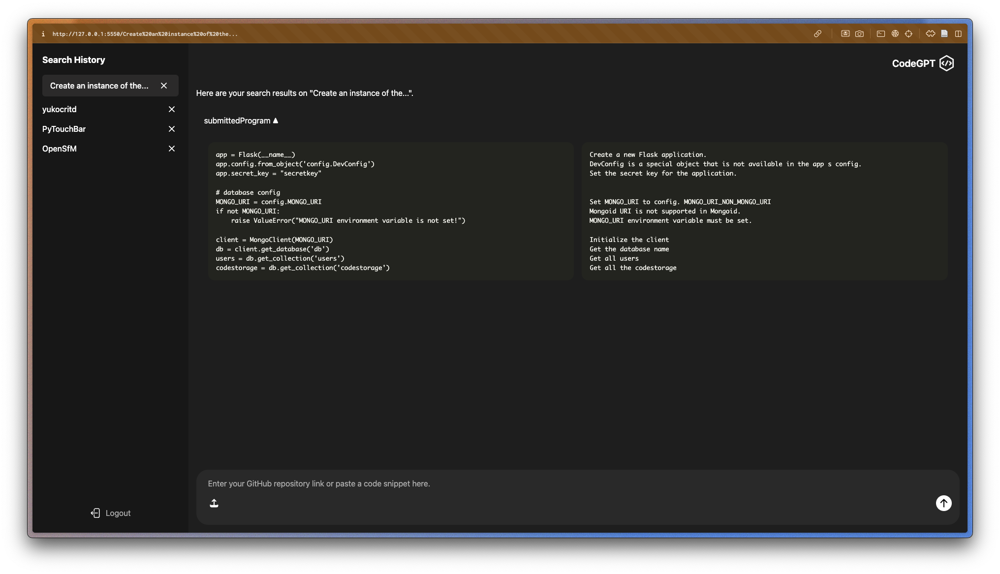
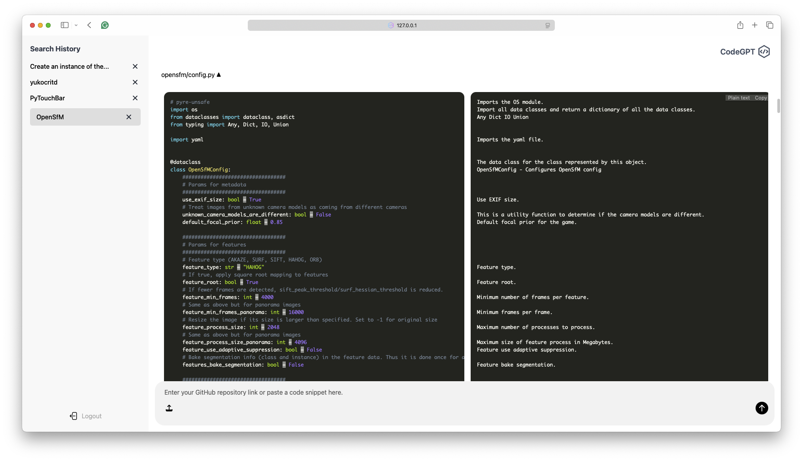
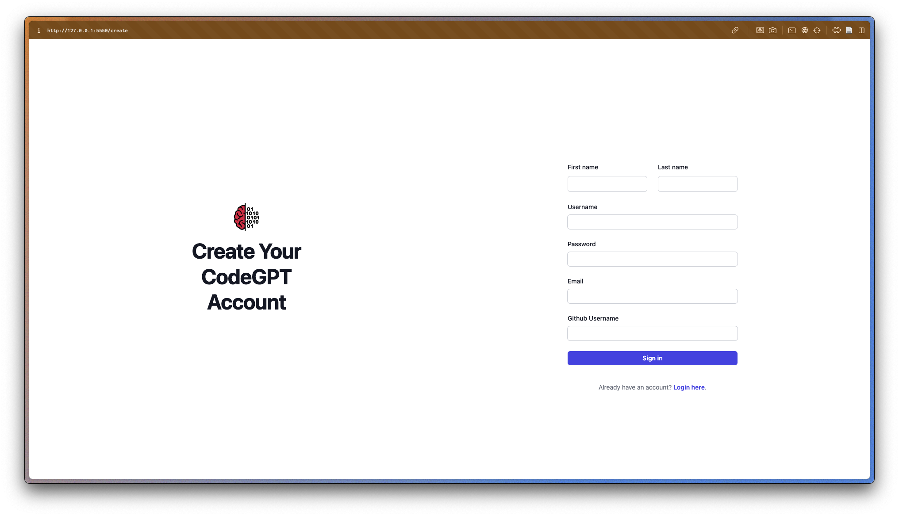
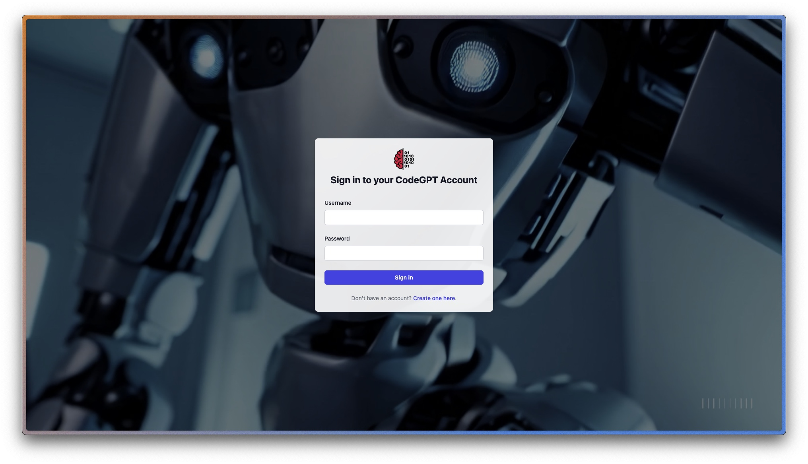

# CodeGPT
<h1 align="center">CodeGPT </h1>

## Inspiration 🧠
Whenever developers are looking into contributing to an existing large-scale project, such as an open-source project on GitHub, it can be a pain trying to understand what each file within the repository does, and how it all ties together to complete complex tasks. Therefore, we came up with the idea of developing an application which can conduct line-by-line summarization of code into human language, allowing developers to quickly understand the project and start contributing. This would be particularly helpful for newer developers with less experience in reading code.

## What it does ⚙️
CodeGPT allows you to submit a GitHub repository link or a code snippet, which it uses to generate a line-by-line summary in plain text. When a GitHub repository link is submitted, our app uses the GitHub API to walk through all files within the repository and retrieve the code in each file. Using a fine-tuned CodeT5 code-to-text model from Hugging Face, all code within the repository can be summarized. The original code and its corresponding summarization are displayed side-by-side, allowing developers to understand the code segments easily. If the user creates an account on our application, it also stores all past searches to allow easy future access. 

## How we built it 👷‍♀️🔧
We built our web application using Python with Flask framework, HTML, Tailwind CSS, MongoDB Atlas for the database and downloaded a CodeT5-base model for code summarization. We used VS Code Liveshare to collaborate on our project together in real time, and Git for version control.

## Challenges we ran into 💀
It was hard to get the CodeT5 Model to generate an accurate and descriptive summary of the code. We tested out many models and worked on fine-tuning the model to improve accuracy. As high schoolers, we don't have much experience working with models, so optimizing its performance was difficult. Unfortunately, we could not use a more powerful model because of the limited processing power on our computers. We also encountered a lot of persistent errors throughout the development process — whenever we completed a feature, something else fell apart 💀.

## Accomplishments that we're proud of 🎉
We're proud of the formatting on our web application - we were able to get syntax highlighting for repository code in almost all programming languages and created a side-by-side view of the code and summaries so the user can scroll through easily. We are also happy with how all the search results can be stored on MongoDB so that past searches can be retrieved and search history remains saved even after logging out. 

## What we learned 📝
This is our first time using MongoDB and MongoDB Atlas so we learned how to store data on the cloud! We also gained experience in using the routing functions and the code blocks within the Flask framework. We have never integrated language models into an application before, so we learned how to load and fine-tune pre-trained ML models from Hugging Face.

## What's next for CodeGPT 🔮
- **Overview of documentation**: Having a model that can generate a paragraph overview on the entire GitHub repository will make the user experience more seamless. Currently, we can only generate a summary for code snippets because parsing through all files in a repository and then summarising would take too long with our computer’s processing power.
- **Upload function**: We want the user to be able to upload their code files directly into CodeGPT in addition to using a Github repository link or code snippet. This would be particularly useful if the user wants a summary of a specific file that is stored locally on their device. 
- **Improving accuracy and level of detail of model**: Our current model makes quite a lot of mistakes when interpreting code, and its description is not very detailed. We want to work on finding datasets that can further train the model so that it works better.
- **Improving runtime**

## Screenshots

